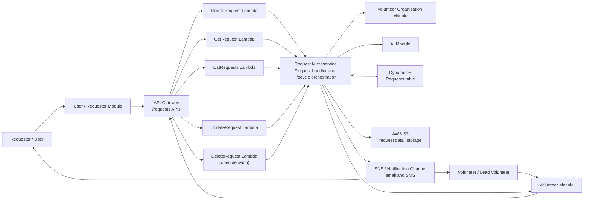

# Request Microservice Requirements

## 1. Purpose

The Request microservice owns the lifecycle of requester help requests in the Saayam platform. It receives new and existing request events, persists request records, coordinates volunteer matching and requester/volunteer handshakes, tracks request status through completion, and sends the notifications needed to keep requesters and volunteers informed.

This document is based on the current repository artifacts, especially [Saayam-Request-Service-Flow.drawio](./Saayam-Request-Service-Flow.drawio). Values shown in the source flow as placeholders, such as `X volunteers` and `Y minutes`, are captured here as configurable requirements.

## 2. Scope

### In Scope

- Create, retrieve, list, update, and possibly delete request records through API Gateway-backed APIs.
- Process a validated new requester request.
- Process an existing request update from the User or Volunteer module.
- Persist request metadata in the request database.
- Store full request details or payload artifacts in AWS S3.
- Publish email/SMS notifications through the notification mechanism.
- Call the Volunteer module to find matching Saayam volunteers.
- Notify matching volunteers and handle the volunteer acceptance window.
- Use the AI module when no volunteer path can satisfy the request.
- Generate and deliver OTPs for requester/volunteer handshake.
- Track assignment, in-progress, pending, failed, and completed request states.
- Support lead volunteer decisions to work alone, add more Saayam volunteers, or involve a volunteer organization.
- Call the Volunteer Organization module when external volunteer organization help is needed.

### Out of Scope

- Request validation that happens before invoking the Request Handler Service, except for defensive validation at API boundaries.
- Volunteer profile matching internals.
- Volunteer organization profile matching internals.
- AI response generation internals.
- Actual SMS/email provider implementation.
- User profile, volunteer profile, and volunteer organization profile ownership.

## 3. Stakeholders and API Participants

| Stakeholder / Participant | Role | Interaction with Request Microservice |
| --- | --- | --- |
| Requester / User | Person asking for help. | Submits new requests through the User/Requester module and receives notifications, AI responses, OTPs, and completion updates. |
| User / Requester Module | Upstream service or API client for requester workflows. | Calls request APIs for new request creation, status lookup, and requester-driven updates. |
| Volunteer | Person accepting or completing a request. | Receives request notifications and OTPs through downstream notification flows; completion may be reported through the Volunteer module. |
| Volunteer Module | Main service for volunteer matching, volunteer notifications, volunteer responses, and lead volunteer actions. | Calls Request APIs for updates and is called by the Request service to find matching volunteers or notify selected volunteers. |
| Lead Volunteer | Assigned volunteer responsible for driving fulfillment. | Works with requester, decides whether more volunteers or a volunteer organization are needed, and triggers progress/completion updates through Volunteer workflows. |
| Volunteer Organization Module | Service for matching and contacting external volunteer organizations. | Called when lead volunteer determines an external organization is needed. |
| AI Module | Service that generates automated responses or guidance. | Called when no suitable volunteer is found or no volunteer accepts within configured matching windows. |
| Notification Service / SNS | Messaging infrastructure for email/SMS and inter-service notifications. | Receives publish requests for requester, volunteer, and completion notifications. |
| Request Database / DynamoDB | System of record for request metadata and status. | Stores request records, lifecycle states, assignment metadata, and update history. |
| AWS S3 | Object storage for request payloads or detailed artifacts. | Stores complete request details after registration and during processing. |
| Operations / Support | Teams monitoring request flow health. | Need searchable request status, error reporting, audit history, and retry visibility. |

## 4. System Context and Component Diagram

## 5. Functional Requirements

### 5.1 Request API Management

| ID | Requirement |
| --- | --- |
| FR-API-001 | The service shall expose `POST /requests` to create or process a new requester request. |
| FR-API-002 | The service shall expose `GET /requests/{id}` to retrieve a single request by request ID. |
| FR-API-003 | The service shall expose `GET /requests` to list requests using supported filters such as requester, status, creation date, assigned volunteer, or pagination token. |
| FR-API-004 | The service shall expose `PUT /requests/{id}` to update an existing request, including lifecycle status changes. |
| FR-API-005 | The service shall decide whether `DELETE /requests/{id}` is supported. If deletion is not supported, the API shall reject it explicitly and require cancellation or archival through a status update instead. |
| FR-API-006 | The service shall return consistent success and error responses with request ID, current status, error code, and message where applicable. |
| FR-API-007 | The service shall authenticate and authorize callers so only approved modules or users can create, read, or update a request. |
| FR-API-008 | The service shall perform defensive validation even when upstream validation has already occurred. |

### 5.2 New Request Processing

| ID | Requirement |
| --- | --- |
| FR-NEW-001 | The service shall accept a validated new user request from the User/Requester module. |
| FR-NEW-002 | The service shall create a unique request ID for every accepted new request. |
| FR-NEW-003 | The service shall register the new request in the request database. |
| FR-NEW-004 | The service shall set the initial persisted status to `Pending` unless a different accepted initial status is configured. |
| FR-NEW-005 | The service shall store full request details in AWS S3 after successful registration. |
| FR-NEW-006 | The service shall send a successful registration notification to the requester by email/SMS with the request ID. |
| FR-NEW-007 | The service shall send a failed registration notification to the requester when registration fails and contact information is available. |
| FR-NEW-008 | The service shall notify the Volunteer module that a new user request is available for volunteer matching. |
| FR-NEW-009 | The service shall record processing errors in a way that allows operations teams to inspect and retry failed work. |

### 5.3 Existing Request Updates

| ID | Requirement |
| --- | --- |
| FR-UPD-001 | The service shall update an existing request when called with a valid request ID. |
| FR-UPD-002 | The service shall allow the User/Requester module and Volunteer module to call update APIs for their approved workflows. |
| FR-UPD-003 | The service shall persist status updates such as `Pending`, `In-Progress`, `Complete`, `Failed`, `Cancelled`, or equivalent configured states. |
| FR-UPD-004 | The service shall send a request completion notification by email/SMS when a request reaches `Complete`. |
| FR-UPD-005 | The service shall reject invalid request IDs, unauthorized updates, and invalid status transitions. |
| FR-UPD-006 | The service shall preserve update timestamps and the actor or source module that performed each status change. |

### 5.4 Volunteer Matching and Notification

| ID | Requirement |
| --- | --- |
| FR-VOL-001 | The service shall request matching volunteers from the Volunteer module using request details. |
| FR-VOL-002 | The service shall handle a response containing zero, one, or many matched volunteers. |
| FR-VOL-003 | The service shall send request notifications to a configurable batch size of `X` matched volunteers. |
| FR-VOL-004 | The service shall wait for volunteer acceptance for a configurable duration of `Y` minutes. |
| FR-VOL-005 | If at least one volunteer accepts within the acceptance window, the service shall continue to requester/volunteer handshake. |
| FR-VOL-006 | If no volunteer accepts within the acceptance window, the service shall notify the next configured batch of volunteers when more matched volunteers are available. |
| FR-VOL-007 | If no matching volunteers are found or no volunteer accepts after configured retry batches, the service shall call the AI module for an alternative requester response. |
| FR-VOL-008 | The service shall persist matching and notification attempts for traceability. |

### 5.5 AI Fallback

| ID | Requirement |
| --- | --- |
| FR-AI-001 | The service shall call the AI module with request details when volunteer matching does not produce an accepted volunteer. |
| FR-AI-002 | The service shall send the AI-generated response to the requester when an AI response is received. |
| FR-AI-003 | The service shall mark request processing as failed and notify the requester when the AI module does not return a usable response. |
| FR-AI-004 | The service shall store AI fallback outcome details with the request record or associated request artifact. |

### 5.6 Requester and Volunteer Handshake

| ID | Requirement |
| --- | --- |
| FR-HS-001 | The service shall generate an OTP after a volunteer accepts a request. |
| FR-HS-002 | The service shall send the OTP to both requester and volunteer through the notification channel. |
| FR-HS-003 | The service shall verify that requester and volunteer acceptance or OTP confirmation completed successfully before assignment is finalized. |
| FR-HS-004 | On successful handshake, the service shall assign the volunteer and update request status to `In-Progress`. |
| FR-HS-005 | If OTP generation, delivery, or confirmation fails, the service shall record the failure and route the request to retry, volunteer rematch, or failed processing according to configured policy. |

### 5.7 Lead Volunteer Fulfillment Flow

| ID | Requirement |
| --- | --- |
| FR-FUL-001 | The service shall support a lead volunteer working directly with the requester until completion. |
| FR-FUL-002 | The service shall support the lead volunteer indicating that more Saayam volunteers are needed. |
| FR-FUL-003 | When more Saayam volunteers are needed, the service shall coordinate with the Volunteer module to obtain and notify additional volunteers. |
| FR-FUL-004 | The service shall support the lead volunteer indicating that a volunteer organization is needed. |
| FR-FUL-005 | The service shall update the request to `Complete` when the lead volunteer, requester, or approved module reports successful completion. |
| FR-FUL-006 | The service shall notify the requester and relevant volunteers when the request is completed. |

### 5.8 Volunteer Organization Flow

| ID | Requirement |
| --- | --- |
| FR-ORG-001 | The service shall call the Volunteer Organization module with request details when external organization help is needed. |
| FR-ORG-002 | The service shall handle a response containing zero, one, or many matched volunteer organizations. |
| FR-ORG-003 | The service shall notify a configurable batch size of `X` volunteer organizations. |
| FR-ORG-004 | The service shall wait for volunteer organization responses for a configurable duration of `Y` minutes. |
| FR-ORG-005 | The service shall support the lead volunteer selecting one organization from matched and accepting organizations. |
| FR-ORG-006 | The service shall track selected organization metadata against the request. |
| FR-ORG-007 | The service shall support completion when the volunteer, volunteer organization, and requester complete the request successfully. |

### 5.9 Notifications

| ID | Requirement |
| --- | --- |
| FR-NOT-001 | The service shall send successful registration notifications to requesters. |
| FR-NOT-002 | The service shall send failed registration or processing notifications to requesters when appropriate. |
| FR-NOT-003 | The service shall send request-detail notifications to matched volunteers. |
| FR-NOT-004 | The service shall send OTP notifications to requester and volunteer. |
| FR-NOT-005 | The service shall send request completion notifications by email/SMS. |
| FR-NOT-006 | The service shall ensure notification payloads include the minimum required identifiers and omit sensitive data not required by the recipient. |
| FR-NOT-007 | The service shall track notification delivery attempts and failures. |

## 6. Request Lifecycle States

The exact enum names may be implementation-specific, but the service shall support these lifecycle concepts:

| State | Meaning | Typical Entry Condition |
| --- | --- | --- |
| `Pending` | Request registered and waiting for matching, acceptance, or next action. | New request persisted successfully. |
| `In-Progress` | Request assigned to a lead volunteer and fulfillment has started. | Volunteer accepts and OTP handshake succeeds. |
| `Complete` | Request has been fulfilled. | Approved completion update from Volunteer or User workflow. |
| `Failed` | Processing cannot continue without manual intervention or retry. | Registration, matching, AI fallback, notification, or persistence failure. |
| `Cancelled` | Request has been intentionally stopped before completion. | Requester, support, or authorized module cancels request. |
| `Archived` | Request is retained but no longer active. | Retention or support workflow after completion/cancellation. |

## 7. Data Requirements

The request record should include at minimum:

- Request ID.
- Requester/user ID.
- Request description and category.
- Location or service area where applicable.
- Priority, urgency, or incident type where applicable.
- Current status.
- Assigned lead volunteer ID when assigned.
- Additional volunteer IDs when applicable.
- Selected volunteer organization ID when applicable.
- S3 object reference for full request details.
- AI response metadata when AI fallback is used.
- Notification and matching attempt metadata.
- Created, updated, completed, and cancelled timestamps where applicable.
- Source module and actor metadata for each status update.

## 8. Integration Requirements

| Dependency | Direction | Required Capability |
| --- | --- | --- |
| API Gateway | Inbound | Route HTTP request APIs to Lambda functions. |
| CreateRequest Lambda | Internal | Create/process new request records. |
| GetRequest Lambda | Internal | Retrieve one request. |
| ListRequests Lambda | Internal | List and filter requests. |
| UpdateRequest Lambda | Internal | Update request state and assignment fields. |
| DeleteRequest Lambda | Internal / Open | Delete, cancel, or reject delete operation depending on product decision. |
| DynamoDB Requests table | Outbound | Persist request records and statuses. |
| AWS S3 | Outbound | Store full request details or large artifacts. |
| SNS / notification channel | Outbound | Publish email/SMS notifications and possibly inter-service events. |
| Volunteer Module API | Outbound and inbound | Find volunteers, send volunteer notifications, receive acceptance/completion updates. |
| Volunteer Organization Module API | Outbound | Find and notify volunteer organizations, track selected organization. |
| AI Module API | Outbound | Generate fallback response when volunteer fulfillment is unavailable. |

## 9. Non-Functional Requirements

| Category | Requirement |
| --- | --- |
| Availability | Core create, get, list, and update APIs should be available independently of optional downstream matching services where possible. |
| Reliability | Persistence operations should be idempotent where retries are possible, especially create, update, notification, and matching operations. |
| Consistency | Status transitions must be validated to prevent conflicting assignments or duplicate completions. |
| Observability | The service shall log request ID, caller, status transition, dependency call result, and failure reason for every major processing step. |
| Security | API callers must be authenticated, authorized, and scoped to the requester, volunteer, or service role they represent. |
| Privacy | Request details, contact data, OTPs, and sensitive requester information must be protected in logs, notifications, database records, and S3 objects. |
| Performance | List APIs must support pagination, and matching/notification workflows must not block synchronous API responses for long-running windows. |
| Configurability | Volunteer batch size `X`, acceptance timeout `Y`, retry count, OTP expiration, and notification templates must be configurable. |
| Auditability | The service shall retain enough history to reconstruct status changes, assignment decisions, and notification attempts. |
| Disaster / surge handling | The matching strategy shall support special high-volume cases such as natural calamities affecting many nearby requesters. |

## 10. Open Decisions

- Should `DELETE /requests/{id}` physically delete a request, soft-delete/archive it, or be omitted?
- What are the authoritative request status enum values and allowed transitions?
- What are the exact values and ownership for `X` volunteer batch size and `Y` response window?
- Which service owns OTP generation and verification if a shared authentication or notification service exists?
- Should long-running matching and retry windows be implemented with asynchronous orchestration such as queues, Step Functions, or scheduled jobs?
- What requester data is safe to send to volunteers and volunteer organizations in request notifications?
- How should natural calamity or neighborhood-scale surge matching differ from ordinary volunteer matching?
- Which module is the source of truth for lead volunteer selection and volunteer organization selection?

