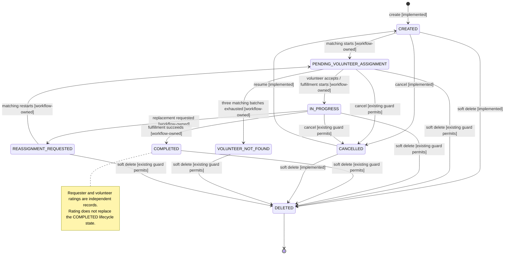

# Request status state model

This document is the Request service's canonical status definition. The numeric IDs are persisted values and must not be renumbered. `RequestStatusEnum.java` and the Request-owned local/test seed in `data.sql` must remain identical.

## Canonical mapping

| ID | Name | Meaning | Lifecycle? | Terminal? |
| ---: | --- | --- | --- | --- |
| 0 | `UNSPECIFIED` | Java/database sentinel for an unselected status. It is not the initial request state and does not collide with `CREATED`. | No | No |
| 1 | `CREATED` | The request exists but has not entered active fulfillment. New and resumed requests use this state. | Yes | No |
| 2 | `PENDING_VOLUNTEER_ASSIGNMENT` | Volunteer matching or assignment is pending. | Yes | No |
| 3 | `IN_PROGRESS` | An assigned volunteer is actively fulfilling the request. | Yes | No |
| 4 | `COMPLETED` | Help was successfully fulfilled. | Yes | Yes |
| 5 | `CANCELLED` | The requester cancelled the request. The current API can resume it to `CREATED`. | Yes | No |
| 6 | `DELETED` | Soft-deleted internal state excluded from active reads. | Yes | Yes |
| 7 | `RATED_BY_REQUESTER` | Legacy compatibility value. Requester ratings are independent records/actions and must not replace `COMPLETED`. | No | No |
| 8 | `RATED_BY_VOLUNTEER` | Legacy compatibility value. Volunteer ratings are independent records/actions and must not replace `COMPLETED`. | No | No |
| 9 | `VOLUNTEER_NOT_FOUND` | Matching exhausted three volunteer batches, approximately 24 hours apart, and requires manual handling. | Yes | No |
| 10 | `REASSIGNMENT_REQUESTED` | The current assignment must be reconsidered; steward intervention may be required. | Yes | No |

IDs 7 and 8 remain reserved for historical compatibility. They must not be reused, and new code must not transition requests into either rating value.

## Supported and intended transitions

Only create, cancel, resume, and soft delete are currently implemented by `RequestServiceImpl`. The matching, assignment, completion, not-found, and reassignment transitions document the states required by the workflow; this change does not add an orchestration system.

The current cancel guard accepts every non-deleted status except `CANCELLED`, including a manually persisted `COMPLETED` or future workflow status. This document classifies `COMPLETED` as terminal but does not silently change that existing API policy; tightening cancellation requires a separate product decision. Resume remains the established `CANCELLED` → `CREATED` transition because the schema does not retain a previous status.

## Delegation and assignment

`DELEGATED` is intentionally not a request lifecycle status. The assignment work represented by Request PR #70 stores `LEAD` and `HELPING` volunteer assignments and can reassign a lead without changing request status. The workflow documented by PR #74 similarly allows helper or volunteer-organization collaboration while the request remains `IN_PROGRESS`. Delegation can therefore coexist with a lifecycle state and belongs in assignment/workflow data rather than the mutually exclusive request-status column.

## Terminology and external data

The Request service uses `PENDING_VOLUNTEER_ASSIGNMENT` and `COMPLETED`. Older documents and the separate database repository use alternatives such as `MATCHING_VOLUNTEER`, `RESOLVED`, `MANAGED`, and `CLOSED`; those names are not aliases in this model.

The database repository's `request_status.csv` is not the source of this mapping and remains a separate Database-team reconciliation item. Deployed RDS contents have not been independently verified.
