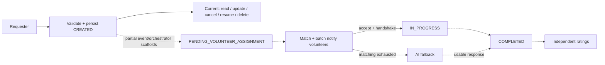
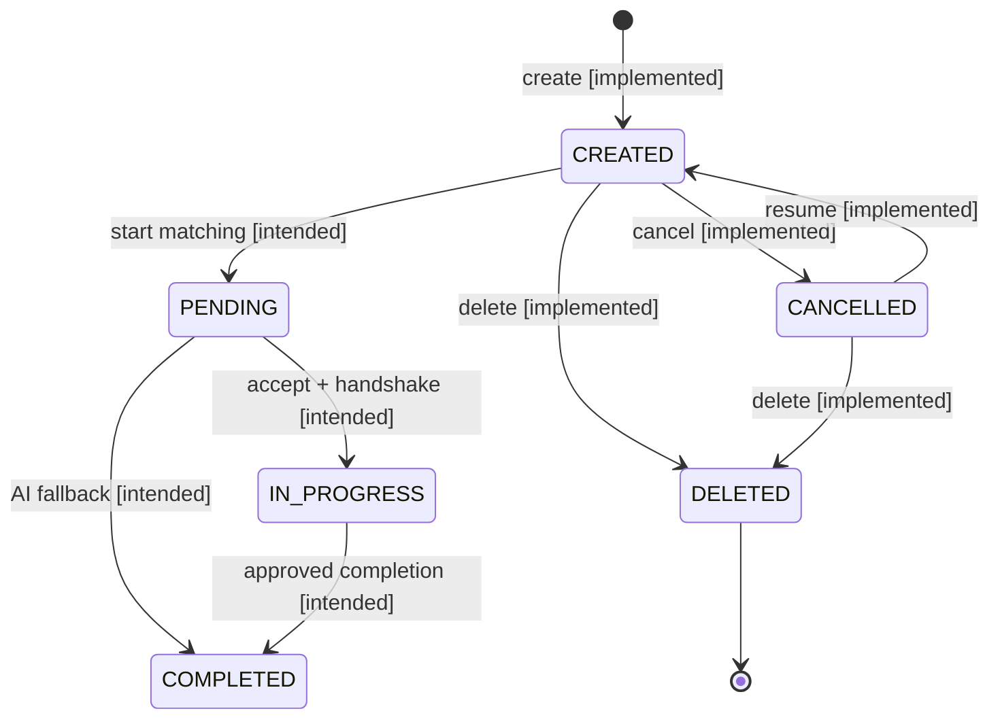

# Saayam Request Workflow and State Model

This is the readable companion to the primary editable Draw.io diagrams:

- [`request-workflow.drawio`](request-workflow.drawio) — detailed five-swimlane end-to-end workflow plus an implementation-coverage page.
- [`request-state-diagram.drawio`](request-state-diagram.drawio) — all nine declared states, current cross-cutting operations, intended lifecycle, and ratings-model warning.
- [`request-workflow-analysis.md`](request-workflow-analysis.md) — repository evidence, branch/commit findings, transition matrix, gaps, and unresolved decisions.

## How to read the diagrams

| Visual treatment | Meaning |
| --- | --- |
| Green, solid | Implemented on `dev` at `3b1f6f341a7e7bce38d676e0041189816227c22f`. |
| Amber | Concrete implementation exists on an unmerged branch or is incomplete scaffolding. |
| Blue, dashed | Historical/intended behavior supported by repository evidence but not implemented end-to-end. |
| Purple | External actor or service/module. |
| Red | Failure/error outcome. |
| Double border | Terminal in the represented model. |

## Operational summary

On `dev`, a requester-addressed API call validates reference IDs, persists a request with `CREATED`, and returns synchronously. The same API surface can read/list/update, cancel, resume, and soft-delete. Resume always returns `CANCELLED` to `CREATED`; delete assigns terminal `DELETED`.

The intended continuation—pending assignment, volunteer matching, batching/timeouts, AI fallback, OTP handshake, assignment, in-progress fulfillment, completion, and ratings—is explicit in the original six-page Saayam Draw.io. Concrete pieces exist on unmerged Step Functions, notifications, and lead/helper assignment branches, but no branch implements the complete lifecycle.

The diagrams therefore show the full evidence-backed product workflow without claiming that unimplemented paths are live.

## Secondary Mermaid workflow

The source is [`request-workflow.mmd`](request-workflow.mmd). It is a compact synchronized summary; it does not replace the intentionally laid-out Draw.io artifact.

## Secondary Mermaid state summary

The source is [`request-state-diagram.mmd`](request-state-diagram.mmd).

## Important conclusions

- The full lifecycle is architecturally documented but not implemented end-to-end.
- Assignment code on PR #70 does not transition the request to `IN_PROGRESS`.
- The Step Functions branch only starts a two-Pass-state workflow.
- The notification pipeline is substantial but unmerged and does not perform volunteer matching.
- `RATED_BY_REQUESTER` and `RATED_BY_VOLUNTEER` are declared statuses without any rating API/data model. They should not be treated as a reliable linear lifecycle until product architecture resolves the two-actor problem.
- No `FAILED` state exists, so the historical processing-failure path is shown as an outcome, not a manufactured state.
